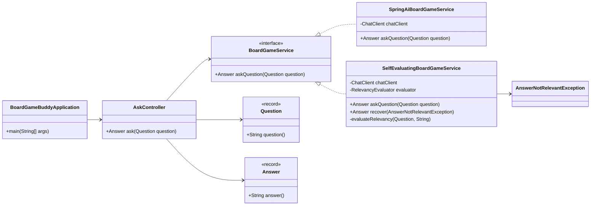

# UML Class Diagram

```mermaid
classDiagram
    direction LR

    class BoardGameBuddyApplication {
        +main(String[] args)
    }
    class AskController {
        +Answer ask(Question question)
    }
    class BoardGameService {
        <<interface>>
        +Answer askQuestion(Question question)
    }
    class SpringAiBoardGameService {
        -ChatClient chatClient
        +Answer askQuestion(Question question)
    }
    class SelfEvaluatingBoardGameService {
        -ChatClient chatClient
        -RelevancyEvaluator evaluator
        +Answer askQuestion(Question question)
        +Answer recover(AnswerNotRelevantException)
        -evaluateRelevancy(Question, String)
    }
    class Question {
        <<record>>
        +String question()
    }
    class Answer {
        <<record>>
        +String answer()
    }
    class AnswerNotRelevantException

    BoardGameBuddyApplication --> AskController
    AskController --> BoardGameService
    BoardGameService <|.. SpringAiBoardGameService
    BoardGameService <|.. SelfEvaluatingBoardGameService
    AskController --> Question
    AskController --> Answer
    SelfEvaluatingBoardGameService --> AnswerNotRelevantException
```
